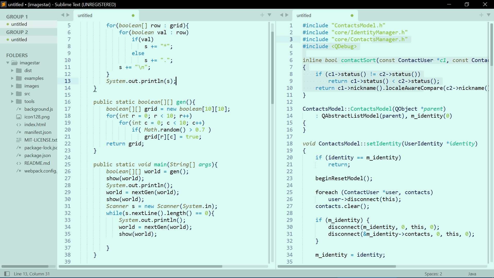
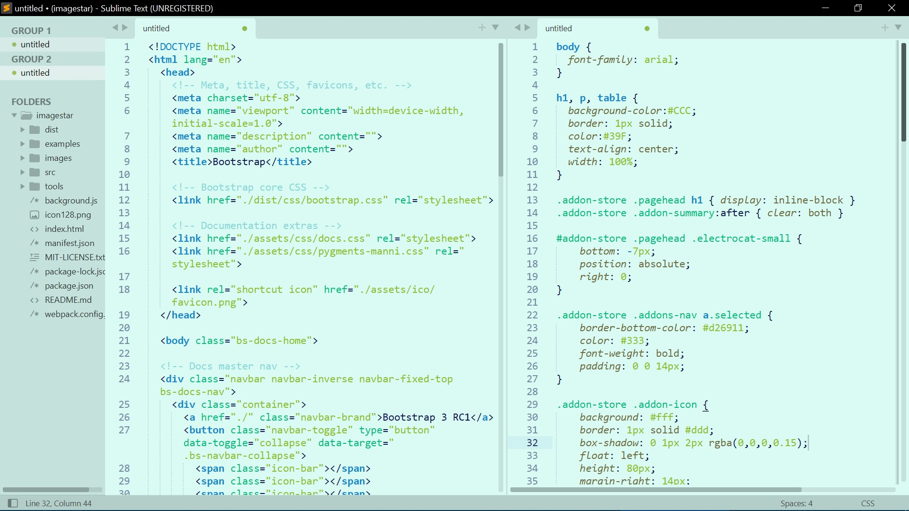

# Seafoam 
Low contrast Seafoam themed color scheme for Sublime Text 3 &amp; 4.

## Install instructions:
  1. Download and extract folder.
  2. Copy the .tmtheme file.
  3. Paste the .tmtheme file into your "C:\Users\ *username* \AppData\Roaming\Sublime Text 3\Packages\" folder.
  4. Apply the color scheme in Sublime Text's menu: "Preferences/Select Color Scheme.../Seafoam Light"
  5. Apply adaptive theme in preferences menu: "Preferences/Select Theme.../Adapitive"
  6. Enjoy the Color Scheme!
